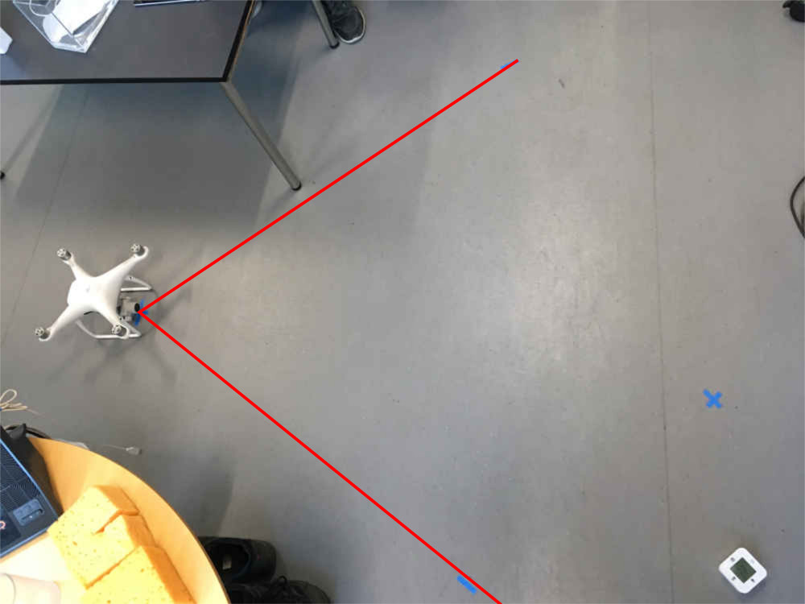
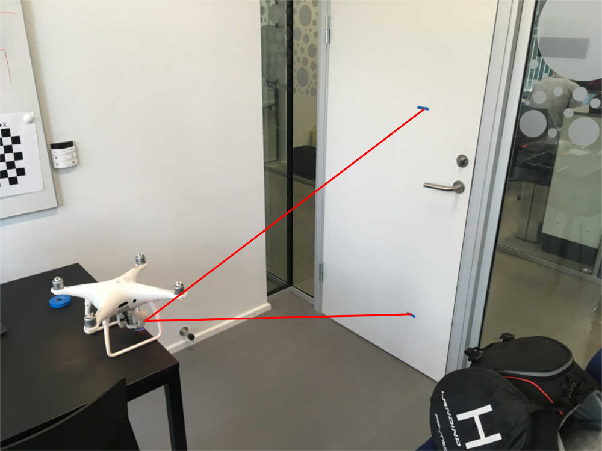

The field of view was determined for the Phantom 4 Pro by using the 
Cosine relation:
$$
\cos(\theta_c) = \frac{a^2 + b^2 - c^2}{2 \cdot a\cdot b}
$$

 


Horisontal field of view

```{r}
a <- 136.5
b <- 124
c <- 151
acos((a^2 + b^2 - c^2) / (2*a*b)) * 180 / pi
```

Vertical field of view
```{r}
a <- 137.3
b <- 136
c <- 96.2
acos((a^2 + b^2 - c^2) / (2*a*b)) * 180 / pi
```



