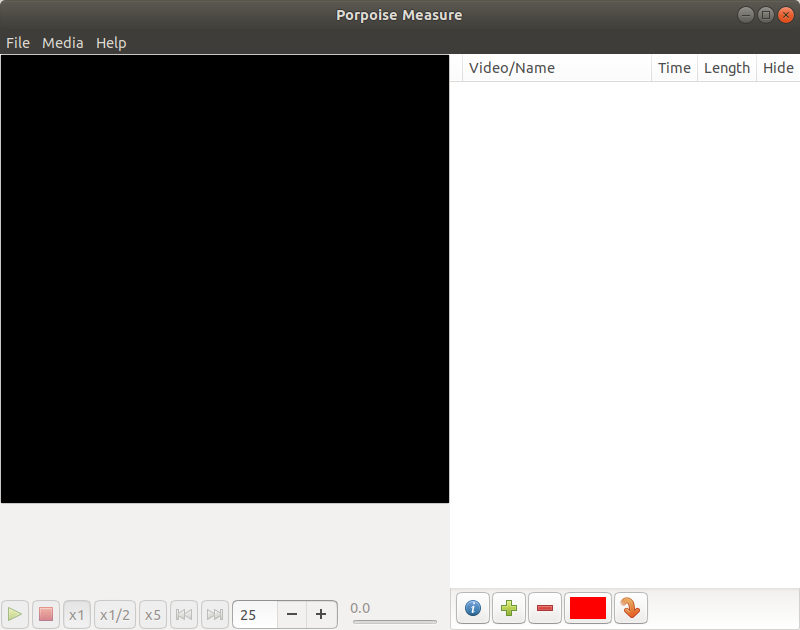
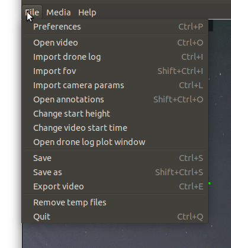
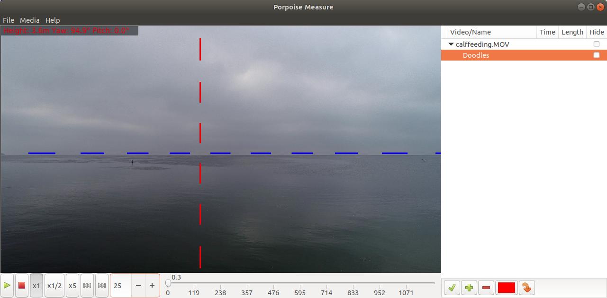
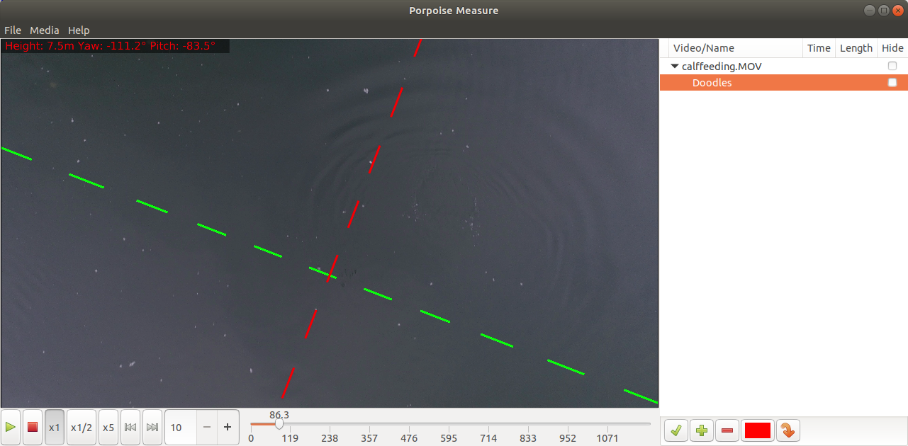
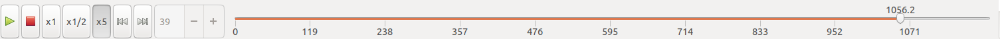
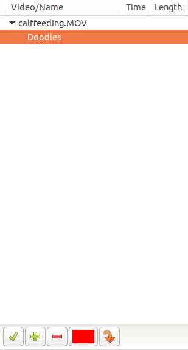
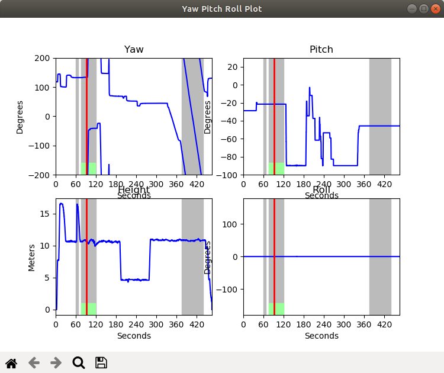
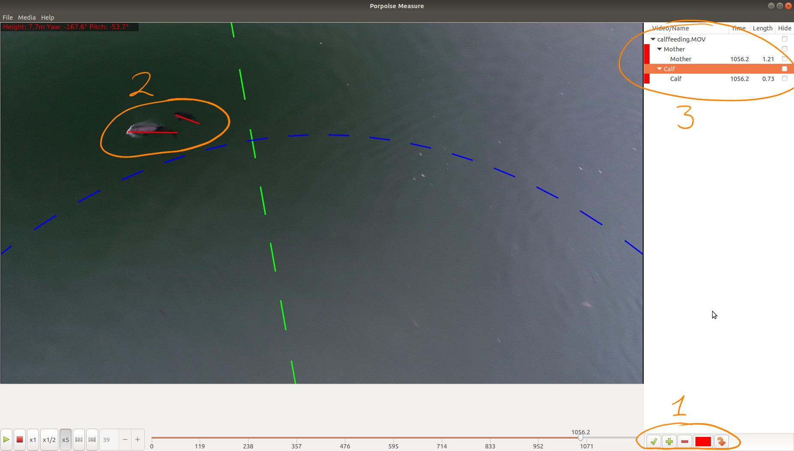

This is a short guide on how to use the Porpoise Tracker program.
Given a matching flight log and video of a marine animal, e.g. a 
harbor porpoise, the program lets the user to track the position of the
marine animal and estimate its length.

To install the program, please follow the [installation guide](installation.md).

Follow this [guide](getting_flight_log_using_itunes.md) to get access to flight 
logs from DJI drones, when an ios device was used together with the remote control.

An example data set is available on [zenodo](https://doi.org/10.5281/zenodo.3257354).

## Using the program

### Launching the program

The program is launched from the command line, by running the commands.
```
cd ~/porpoisetracker
source env/bin/activate
cd PorpoiseTracker
python porpoisetracker.py
```

At this point, the main window is displayed.



### Loading data into the program

It is now time to load video, logfile and camera information into the system.
The video should origin from a DJI drone eg. a Phantom or Mavic; these video files are usually named like `DJI_0013.MOV`.
The log file should be from the same flight. It is usually named like `DJIFlightRecord_2015-10-05_[09-39-07].txt`.
The file containing information about the field of view, should have contents like shown below:
```{bash eval=FALSE, include=TRUE}
horizontal_fov,vertical_fov
71.15,43.97 
```
Enter the File menu and `Open video`, `Import drone log` and `Import fov`.




After having loaded the required data into the program, the two windows will
be displayed.
The first window shows the first frame from the video and the second 
window contains curves representing the drone height and camera orientation 
during the flight.


### Main window

The main window consists of three elements: the video display (top left), 
video navigation toolbar (botton left) and an annotation widget (right).

#### Video display

The video display, shows the current frama from the video and
details about the camera heigth and orientation.
The camera height and orientation is displayed as rough numbers in the 
top left corner of the video display.
The camera orientation is specified by the numbers: yaw, pitch and roll.
The yaw is the compas heading of the camera, the pitch is the angle between
the horisontal plane and the camera orientation; and finally the roll
is how much the horizon is tilted in the image.

Based on the camera orientation and information about the field of view
of the drone, an artificial horizon is added to the video display.
The artificial horison contains the following elements:

* Horizontal line (pitch = 0), shown with a dashed blue line
* Negative 45 degree pitch line (pitch = -45 degree), shown with a dashed blue line
* East/west direction indicator, shown with a red dashed line
* and a north south direction indicator, shown with a green dashed line.

When playing back the video, it is important to observe the 
artificial horizon and see if it follows the motion of the camera.
If the artificial horizon moves independently of the camera, 
it indicates that the video and logfile is not matched properly
and that the generated results will be **invalid**.








#### Video navigation toolbar

The video navigation toolbar is used to control playback of the video.
Leftmost there are the play/pause and stop buttons
and to the right there is a slider which shows how long the video has 
progressed.




#### Annotation widget

The annotation widget contains a list of objects of which their location or
extend have been annotated in the video and a control bar positioned at the bottom.

The control bar has the following entries

* Status indicator (green if all required information have been loaded)
* Button for adding a new observation object
* Button for removing a single observation or an observation object including all associated observations.
* Color selector 
* Button for jumping to the frame of the currently selected observation




### Yaw, pitch and roll plot

After opening a drone log file, the Yaw, pitch and roll plot open automatically.
In the plot, it is possible to see how the yaw, pitch and roll of the camera and 
the UAV altitude changes over time.
The current time of the frame shown in the main windows is indicated with a 
vertical red line in the plots.
The time indication is only updated when the video is paused.

The areas that are marked with a grey shade, is when the UAV was recording a video.
The bright green rectangle shows the timewise alignment between the logfile and
the video.
If the timewise alignment of video and logfile is wrong, it is possible to realign 
the video by clicking on a gray shaded region in the Yaw, pitch, roll plot.





### Annotating





### Exporting data to csv files


# Todo: 

